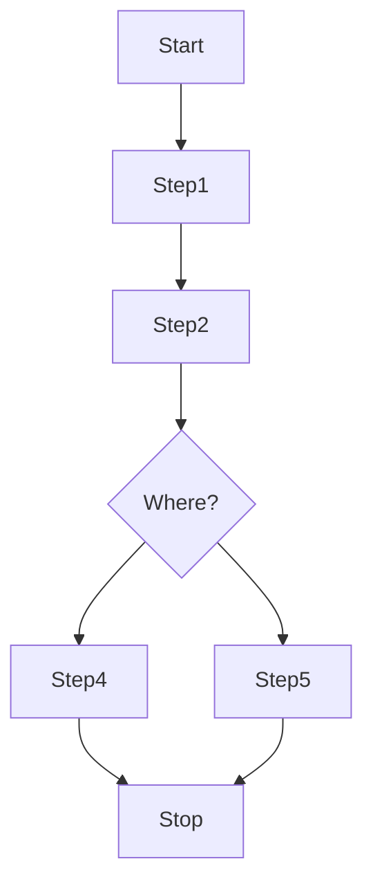

# UML Diagrams

This application supports the `mermaid` js to render the UML diagrams generated using simple scrips.

> UML diagrams can be rendered on the fly using `mermaid.js` library.
> 
> This library uses simple script to generate the UML diagram.
> 
> Below is the example of the graph generated using this library.
>



**Code for Graph**

```
graph TD

    Start --> Step1
    Step1 --> Step2
    
    Step2 --> dir{Where?}
    
    dir --> Step4
    dir --> Step5
    
    Step4-->Stop
    Step5-->Stop
    Stop
```

Follow this link: [mermaid.js](https://mermaid-js.github.io/mermaid/#/) to visit the official documentation and examples