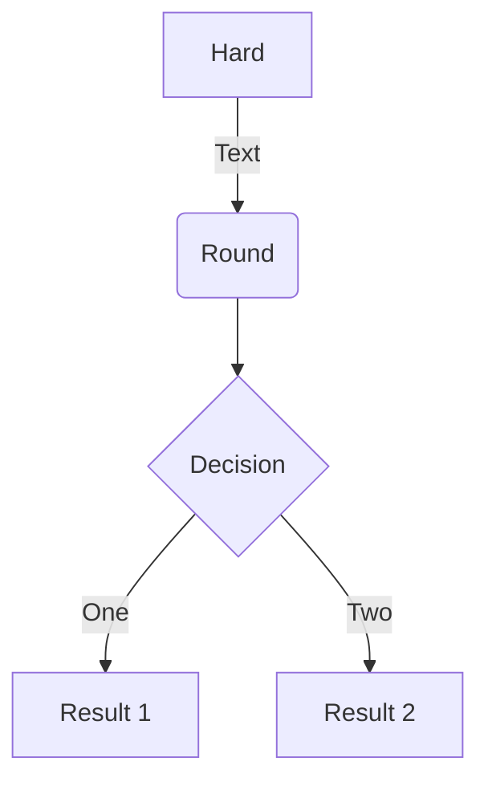

# This is a test
## Content
                
```java  
public static void main(String args[]){
    System.out.println("This is test code.");
}
```
                

                
???+ info
    Support for latex math. This is block code.
    ```math
    \sqrt{3x-1}+(1+x)^2
    ```
                
???+ tip "This is math with inline code"
    $`a^2+b^2=c^2`$
                
???+ success
    This is dummy note
                
> This is block.
                
- [ ] This is TODO-1
- [x] This is TODO-2
                
### List
                
- Item1
- Item2
    - Sub-item
    
### Table
                
|    Heading Centered    | Heading Left Aligned   |  Heading Centered  |   Heading Right Aligned |
|------------------------|:-----------------------|:------------------:|------------------------:|
| Cell text left aligned | Cell text left aligned | Cell text centered | Cell text right aligned |
| cell 21                | cell 22                |      cell 22       |                 cell 22 |